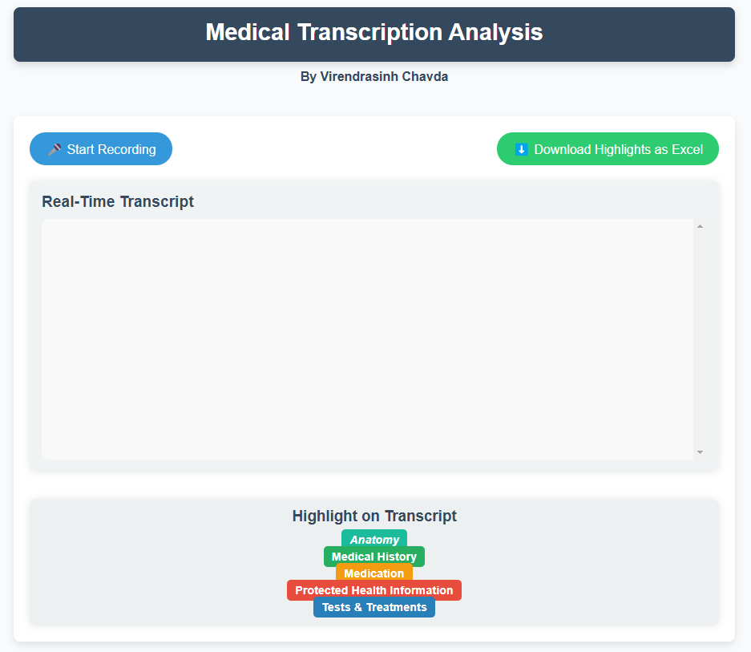

# Medical Transcription Analysis App
### Author: Virendrasinh Chavda

<p align="justify">
This repository contains the code for a real-time medical transcription analysis application built with **Flask**, **AssemblyAI**, and **Flask-SocketIO**. This tool enables users to transcribe and analyze medical audio data, highlighting key entities such as Protected Health Information (PHI), Medical Conditions, Anatomy, Medications, and Tests or Treatments in real-time. The app is ideal for healthcare professionals and researchers who need efficient, categorized insights from audio transcriptions.
</p>

## Table of Contents
1. [Overview](#Overview)
2. [Features](#Features)
3. [Technologies Used](#Technologies-Used)
4. [Setup and Installation](#Setup-and-Installation)
5. [Usage](#Usage)
6. [Future Enhancements](#Future-Enhancements)
7. [Contributing](#Contributing)
8. [License](#License)

## Overview
<p align="justify">
Medical transcription can be time-consuming, especially when analyzing and categorizing complex information. This app allows users to transcribe audio in real-time and automatically highlights key medical information in the transcription. By leveraging **AssemblyAI** for transcription and **Flask-SocketIO** for real-time updates, the app provides a structured output with essential medical data in an easy-to-read format.
</p>



## Features
* **Real-Time Transcription**: Transcribe audio in real-time, updating the transcript as you speak.
* **Category-Based Highlighting**: Automatically highlights PHI, Medical Conditions, Anatomy, Medications, and Treatments in the transcription.
* **Downloadable Data**: Save categorized highlights as an Excel file for further analysis.
* **Intuitive UI**: Easy-to-use interface that makes medical transcription accessible for users.

## Technologies Used
* **Flask**: Backend web framework for handling requests and managing API connections.
* **Flask-SocketIO**: For WebSocket support and real-time data streaming.
* **AssemblyAI**: For converting audio to text and enabling entity-based analysis.
* **Python**: Core backend language for handling logic and integration.
* **Pandas & XlsxWriter**: For generating and exporting categorized data in Excel format.

## Setup and Installation

1. **Clone the Repository**
   ```bash
   git clone https://github.com/VirendraChavda/medical-transcription.git
   cd Medical-Transcription-Analysis-App
   ```
2. **Install Required Packages**
   ```bash
   pip install -r requirements.txt
   ```
3. **Set Up API Key**
   ```bash
   AI_API_KEY=your_assemblyai_api_key
   ```
4. **Run the Application**
   ```bash
   python app.py
   ```
## Usage
<p align="justify"> 
Once the app is running, click "Start Recording" to begin transcribing in real-time. The transcription will display with color-coded highlights for different medical categories, allowing for easy review. You can download the categorized data as an Excel file for further documentation or analysis. 
</p>

## Future Enhancements
* **Additional Language Support**: Enable transcription and analysis in multiple languages.
* **Advanced NLP**: Integrate more sophisticated NLP models to improve entity recognition accuracy.
* **Data Visualization**: Add charts or graphs to visually represent categorized data in the transcript.

## Contributing
<p align="justify"> 
Contributions are welcome! If you have suggestions or want to report an issue, please open an issue or pull request. For major changes, discuss them in an issue to ensure alignment with the project’s goals. 
</p>

## License
This project is licensed under the MIT License. See the [LICENSE](LICENSE) file for more details.

